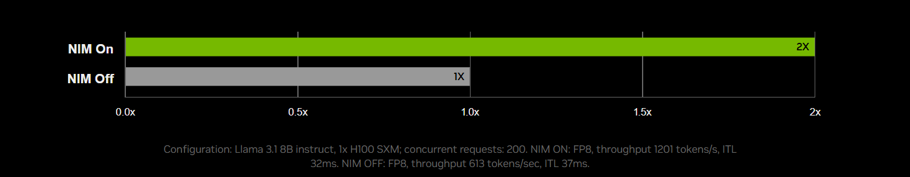

# 🚀 NVIDIA NIM: The Game-Changer in AI Model Deployment


---

## 🎯 The AI Deployment Challenge We All Face

As AI practitioners and data scientists, we've all been there. You've trained a state-of-the-art model, achieved impressive metrics, and now comes the hardest part—deploying it to production. The reality? It shouldn't feel like launching a rocket, but for most teams, it does.

Wrestling with CUDA versions, dependency conflicts, containerization nightmares, and infrastructure complexities can turn a simple deployment into weeks of engineering overhead. **This is where NVIDIA NIM changes everything.**

---

## 💡 What is NVIDIA NIM?

**NVIDIA NIM (Neural Inference Microservices)** is a revolutionary set of easy-to-use inference microservices that dramatically accelerates the deployment of foundation models across any infrastructure—cloud, data center, workstations, or even edge devices.

Think of NIM as your production-ready AI deployment toolkit that comes **pre-optimized, pre-configured, and ready to scale** in minutes, not weeks.


---

## 🔑 Key Features That Make NIM Stand Out

### 1️⃣ **One-Command Deployment**
Deploy AI models with a single command. NIM eliminates the complexity of manual configuration and infrastructure setup.

### 2️⃣ **Pre-Optimized Performance**
NIM provides optimized throughput and latency out of the box to maximize token generation, support concurrent users at peak times, and improve responsiveness. Running Meta Llama 3-8B in NIM produces up to **3x more tokens** compared to traditional setups.

### 3️⃣ **Universal Deployment**
Run anywhere—from RTX AI PCs and workstations to data centers and cloud platforms. NIM microservices expose industry-standard APIs for simple integration into AI applications, development frameworks, and workflows.

### 4️⃣ **Enterprise-Grade Security**
Keep your data secure with production-grade runtimes, ongoing security updates, and support for encryption, authentication, and authorization.

### 5️⃣ **Continuous Optimization**
NIM microservices are continuously updated with the latest optimized inference engines, boosting performance on the same infrastructure over time.

---

## 📊 Real-World Impact: The Numbers Speak

**Performance Boost:**
- Configuration: Llama 3.1 8B instruct on 1x H100 SXM
- **With NIM:** 1,201 tokens/s throughput, 32ms latency
- **Without NIM:** 613 tokens/s throughput, 37ms latency
- **Result:** Nearly **2x throughput improvement** with NIM optimization




---

## 🌐 Supporting 40+ AI Models Across Modalities

NVIDIA NIM provides access to over **40 foundation models**, including:

**Large Language Models:**
- Meta Llama 3.1 & Llama 3
- Microsoft Phi-3
- Mistral Large & Mixtral 8x22B
- Google Gemma
- Databricks DBRX
- Snowflake Arctic

**Specialized Domains:**
- 🧬 **BioNeMo NIM** for drug discovery and molecular prediction
- 🎨 **Picasso NIM** for visual content creation
- 💬 **ACE NIM** for interactive digital humans
- 🎬 **OpenUSD NIM** for 3D world creation and digital twins

---

## 🏗️ How NIM Works: The Architecture

```
┌─────────────────────────────────────────────┐
│         NIM Microservice Container          │
├─────────────────────────────────────────────┤
│  ✅ Pre-optimized AI Models                 │
│  ✅ Runtime Stack (TensorRT-LLM, CUDA)      │
│  ✅ Industry-Standard APIs (REST/gRPC)      │
│  ✅ Inference Engines (vLLM, SGLang)        │
└─────────────────────────────────────────────┘
              ↓
┌─────────────────────────────────────────────┐
│      Deploy on Any NVIDIA Infrastructure     │
│   🖥️ Cloud | 💻 Data Center | 🔧 Workstation │
└─────────────────────────────────────────────┘
```

NIM microservices come with everything AI teams need—the latest AI foundation models, optimized inference engines, industry-standard APIs, and runtime dependencies—prepackaged in enterprise-grade software containers ready to deploy and scale anywhere.

---

## 💼 Industry Adoption: Who's Using NIM?

**Nearly 200 technology partners** are integrating NIM into their platforms:

- **Cloud Providers:** AWS SageMaker, Microsoft Azure AI, Google Cloud
- **MLOps Platforms:** Dataiku, DataRobot, Hugging Face
- **Enterprise Partners:** Cadence, Synopsys, Redis
- **Development Platforms:** Red Hat OpenShift AI, Databricks

85% of businesses consider AI to significantly enhance customer experience by 2025, highlighting the growing demand for solutions like NVIDIA NIM.


---

## 🎯 Real-World Use Cases

### 1. **Healthcare & Drug Discovery**
Accelerate surgical planning, clinical trial optimization, and novel protein structure generation with BioNeMo NIM microservices.

### 2. **Customer Service**
Build lifelike digital humans for customer service, telehealth, and education with ACE NIM microservices.

### 3. **Enterprise Copilots**
Deploy AI assistants and code generation tools with minimal infrastructure overhead.

### 4. **Content Creation**
Generate and customize visual content with Picasso's Edify models trained on licensed libraries.

### 5. **Industrial Digital Twins**
Build physically based virtual worlds and digital twins to drive innovation while preparing for the next wave of AI: robotics using OpenUSD NIM microservices.

---

## 🚀 Getting Started with NVIDIA NIM

### For Developers (FREE Access):
1. Join the **NVIDIA Developer Program**
2. Access NIM for free for research, development, and testing
3. Start prototyping with hosted APIs on NVIDIA DGX Cloud

### For Enterprises:
1. Deploy through **NVIDIA AI Enterprise** software platform
2. Get production-grade support with ongoing security updates
3. Maximize infrastructure ROI with 3x performance improvements

### Quick Start:
```bash
# Deploy a model with a single command
docker run -it --gpus all \
  -e NGC_API_KEY=$NGC_API_KEY \
  nvcr.io/nvidia/nim/meta/llama-3.1-8b-instruct:latest
```

---

## 📈 The Future of AI Deployment

The generative AI market is projected to reach $190 billion by 2025, and NVIDIA NIM is at the forefront of making enterprise AI accessible, scalable, and efficient.

**Key Takeaways:**
- ⚡ **3x faster inference** compared to traditional deployment
- 🔧 **40+ pre-optimized models** ready to deploy
- 🌍 **200+ partners** integrating NIM into their platforms
- 🚀 **5-minute deployment** from download to production
- 🔐 **Enterprise-grade security** with continuous updates

---

## 🎓 Why This Matters for Data Scientists

As data scientists and AI engineers, we should focus on building great models, not fighting infrastructure battles. NVIDIA NIM gives us back our time by:

✅ Eliminating dependency hell and CUDA conflicts  
✅ Providing production-ready inference out of the box  
✅ Scaling seamlessly from prototype to production  
✅ Reducing operational costs with optimized performance  
✅ Ensuring security and compliance for enterprise deployment  

---

## 🔗 Resources to Explore

- **Try NIM APIs:** [build.nvidia.com](https://build.nvidia.com/explore/discover)
- **Documentation:** [docs.nvidia.com/nim](https://docs.nvidia.com/nim/)
- **Developer Portal:** [developer.nvidia.com/nim](https://developer.nvidia.com/nim)
- **Hugging Face Integration:** Deploy Llama 3 NIM in just a few clicks

---

## 💭 Final Thoughts

NVIDIA NIM represents a paradigm shift in how we deploy AI models. It's not just about faster inference—it's about **democratizing enterprise AI deployment** for millions of developers worldwide.

Whether you're building the next generation of AI copilots, deploying digital humans for customer service, or accelerating drug discovery with generative biology, NIM makes it possible to go from idea to production in minutes, not months.

**The future of AI deployment is here. It's containerized, optimized, and ready to scale.**

---

**What are your thoughts on NVIDIA NIM? Have you tried deploying models with it? Share your experiences in the comments! 👇**

---

### 📬 Connect With Me

**Shivam Kumar**  
Data Scientist | Cloud & GenAI Enthusiast

📧 Email: [shivamlko9832@gmail.com](mailto:shivamlko9832@gmail.com)  
🔗 LinkedIn: [linkedin.com/in/shivamlko9832](https://linkedin.com/in/shivamlko9832)  
💻 GitHub: [github.com/shivamlko9832](https://github.com/shivamlko9832)

---

**#NVIDIA #NIM #GenerativeAI #MachineLearning #AIDeployment #MLOps #DataScience #CloudComputing #ArtificialIntelligence #TechInnovation #DeepLearning #AIInfrastructure #EnterpriseAI**

---

*💡 Found this helpful? Hit the like button, share with your network, and follow for more insights on AI, Cloud, and Data Science!*
